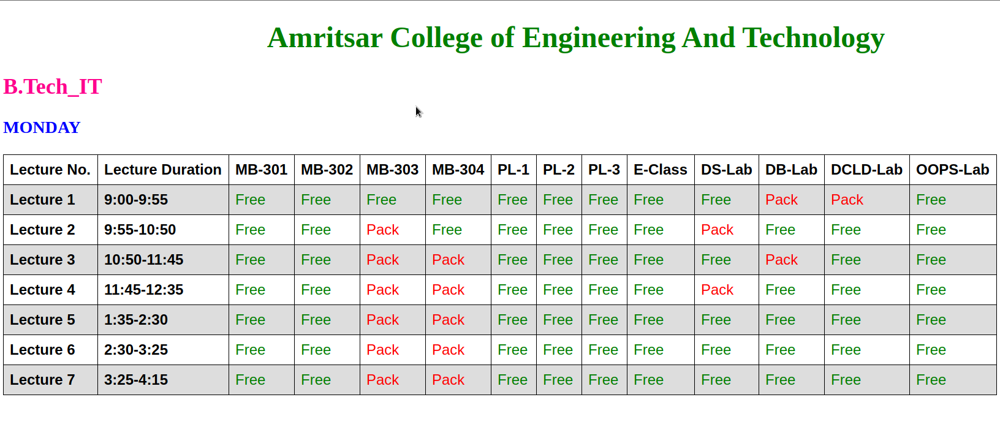

# Type Practice Lite

Best way to sharp your typing skill.

## Getting Started

Type practice is a small and lite application build with C++ to practice and achieve the best typing skills.

### Features
- Easy to Run.
- Easy to learn typing and increase your typing speed.
- Free software.
- Bug free.
- Numbers of Stories to practice.
- Regular updates.
- Small in size.
- You can practice on Your own Story.

### Prerequisites

This application is built for Windows platform.
If you have a Windows platform then you can run it simply by double-click you don't need to install it.

### Download
Link - [Type Practice Lite](https://sourceforge.net/projects/type-practice-lite/)

### Runing
just double click on the downloaded app and then start your typing practice.

## Built With

* [C++ 11](https://en.cppreference.com/w/cpp/11) - C++ is a high-level, general-purpose programming language created by Bjarne Stroustrup.

## Authors

* **Abdhesh Nayak** - [Github](https://github.com/abdheshnayak), [LinkedIn](https://www.linkedin.com/in/abdhesh-nayak/)

See also the list of [contributors](https://github.com/abdheshnayak/Type-Practice-Lite/contributors) who participated in this project.
